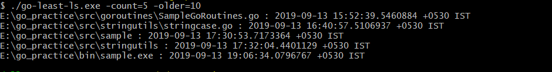
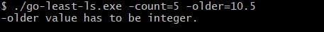

# go-least-ls
A command line utility to list (ls) least recently used files.<br>
A simple command line tool to check older files in the system.

Usage:
```
./go-least-ls -count=10 -older=60 -filetype .txt [-all]
```
Utility lists all the least recently used files (that are not hidden) based on the file type mentioned in the current directory older <br>
than `-older=<value>` mentioned.<br>
```
-count : Default is 5
-older : Default is 30
-all   : Default is false
```
**NOTE**: Currently, Hidden file check is only for linux/unix OS.



`count` and `older` flags has to be integer.

