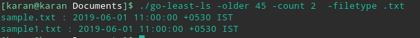

# go-least-ls
A command line utility to list (ls) least recently used files.<br>
A simple command line tool to find old and unused files/directory in your system.

Usage:
```
./go-least-ls -count=10 -older=60 -filetype .txt [-all]
```
Flags:
```
-count    : Number of files to show/list, oldest file will be at top. 
            Default value is 5. It should be an integer.
-older    : How older a file should be shown? Value is number of days. 
            Default value is 30. It should be an integer.
-filetype : File type, extension of files to be searched. It should be a string. 
            Ex: -filetype .txt
-all      : By default, utility does not list hidden files. Mention this flag to list hidden files.
```
**NOTE**: Currently, Hidden file check is only for linux/unix OS type.

Examples:<br>
Default usage:<br>


Using `-count` and `-older` flags to list files based on the values passed:<br>
<br>
 

Using `-all` to list hidden files:<br>
 

Using `-filetype` to list files based on extension mentioned:<br>
 

---
##License
MIT License

Copyright (c) 2019 Karan Nadagoudar

Permission is hereby granted, free of charge, to any person obtaining a copy
of this software and associated documentation files (the "Software"), to deal
in the Software without restriction, including without limitation the rights
to use, copy, modify, merge, publish, distribute, sublicense, and/or sell
copies of the Software, and to permit persons to whom the Software is
furnished to do so, subject to the following conditions:

The above copyright notice and this permission notice shall be included in all
copies or substantial portions of the Software.

THE SOFTWARE IS PROVIDED "AS IS", WITHOUT WARRANTY OF ANY KIND, EXPRESS OR
IMPLIED, INCLUDING BUT NOT LIMITED TO THE WARRANTIES OF MERCHANTABILITY,
FITNESS FOR A PARTICULAR PURPOSE AND NONINFRINGEMENT. IN NO EVENT SHALL THE
AUTHORS OR COPYRIGHT HOLDERS BE LIABLE FOR ANY CLAIM, DAMAGES OR OTHER
LIABILITY, WHETHER IN AN ACTION OF CONTRACT, TORT OR OTHERWISE, ARISING FROM,
OUT OF OR IN CONNECTION WITH THE SOFTWARE OR THE USE OR OTHER DEALINGS IN THE
SOFTWARE.
